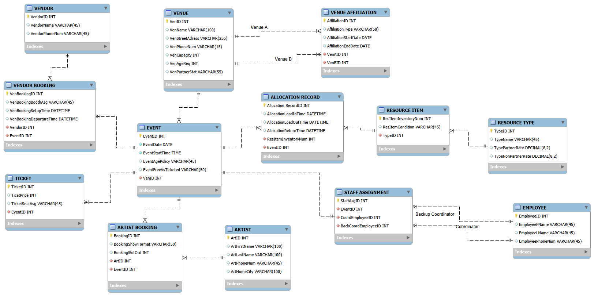
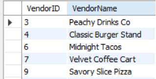
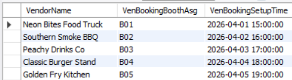
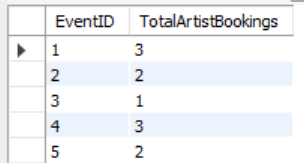
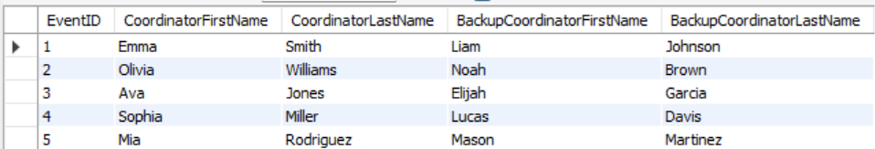
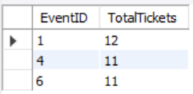
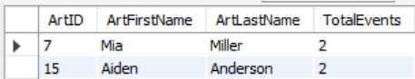
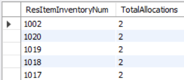
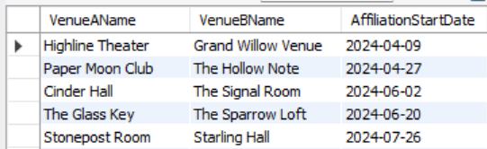
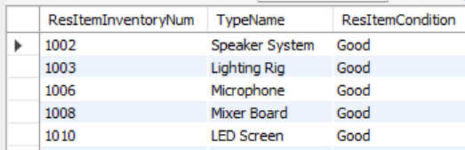

## MIST4610 Project GroupA3

Catherine Brumbeloe - Group Leader  
Camryn Copeland- SQL Writer  
Joseph Halab - Data Wrangler  
Diya Mopur - Database Designer  
Sachit Juneja - Conceptual Modeler  

---

## Case Description

Live Music Circuit (LMC) organizes concerts around Athens, Georgia by managing venues, artists, events, staff, vendors, and equipment resources. They maintain records on all venues they work with and also track venue affiliations to document relationships between venues, past or present.  

Each concert, or event, takes place at a single venue on a specific date and time and includes one or more performing artists. LMC records these performances through artist bookings, which capture which artists appear at which events and in what order. Events may be free or ticketed, and LMC tracks all tickets associated with each event.  

Every event requires staffing, so LMC uses staff assignments to link a main coordinator and a backup coordinator to each event. Coordinators come from LMC’s pool of employees, whose basic information is stored in the system.  

LMC also manages resource items such as speakers and lighting, each belonging to a resource type that determines pricing for partner and non-partner venues. Equipment can be scheduled for events through allocation records, which track when items are in use and ensure no item is double-booked.  

In addition, LMC works with external vendors like food trucks or merchandise sellers. Vendor participation at events is tracked through vendor bookings, which record their involvement and logistics. Overall, the system connects venues, artists, staff, vendors, and equipment to support flexible event planning.

---

## Data Model

Vendor and Event have a many-to-many relationship, creating a new entity Vendor Booking that has a one-to-many with Event and Vendor. One event has many vendor bookings and one vendor has many vendor bookings.  

Event and Ticket have a one-to-many relationship. One event sells many tickets and one ticket goes to one event.   

Event and Venue have a one-to-many relationship. One venue host many events and one event is at one venue.  

Event to Resource Item is a many-to-many, creating a new entity Resource Allocation that has a one-to-many with Event and Resource Item. One Event has many resource allocations and one resource item has many resource allocations.  

Resource Item and Resource Type have a one-to-many relationship. Each resource type can have many items, but each item can only have one type.  

Event and Artist has a many-to-many relationships, creating a new entity Artist Booking. One event host many artist and one artist plays many events. With the artist booking, one artist has many bookings and one event has many bookings.  

Event and Staff Assignment have a one-to-one relationship. One event has one staff assignment and one staff asignment has one event.  

Staff Assignment and Employee has two one-to-many relationships. One for a coordinator and one for a backup coordinator. Each staff assignment has one coordinator and one backup coordinator, and each employee can have many staff assignments.  

Venue and Venue Affiliation have two one-to-many relationships. One for Venue A and one for Venue B. A venue can have multiple venue affiliations, but each affiliation can only between one other venue.   

---

## Data Dictionary 

> **Note:** All venue operations are limited to Athens, GA (ATH). Therefore city, state, and zip code are not tracked separately in the address field.

---

### Table: VENUE 

| Column Name    | Data Type    | Length | Key | Description                                                                 |
|----------------|--------------|--------|-----|-----------------------------------------------------------------------------|
| ven_ID         | INT          | —      | PK  | Unique identifier for each venue; auto-incremented                          |
| ven_name       | VARCHAR      | 35     | —   | Name of the venue                                                           |
| ven_address    | VARCHAR      | 100    | —   | Street address of the venue (city/state/zip omitted; all venues in Athens)  |
| ven_pnumber    | VARCHAR      | 15     | —   | Primary contact phone number for the venue                                  |
| ven_capacity   | INT          | —      | —   | Maximum number of attendees the venue can hold                              |
| ven_ageReq     | INT          | —      | —   | Minimum age requirement for entry (e.g., 18, 21; 0 if all-ages)            |
| ven_permStat   | VARCHAR      | 30     | —   | Current permit/licensing status of the venue (e.g., Active, Pending)        |

---

### Table: VENUE_AFFILIATION 

| Column Name    | Data Type    | Length | Key | Description                                                                 |
|----------------|--------------|--------|-----|-----------------------------------------------------------------------------|
| aff_ID         | INT          | —      | PK  | Unique identifier for each affiliation record; auto-incremented             |
| ven_ID         | INT          | —      | FK  | References VENUE; identifies which venue holds this affiliation             |
| aff_type       | VARCHAR      | 50     | —   | Type/category of the affiliation (e.g., Sponsorship, Partnership)           |
| aff_startDate  | DATE         | —      | —   | Date on which the affiliation agreement began                               |
| aff_endDate    | DATE         | —      | —   | Date on which the affiliation agreement ends or ended                       |

---

### Table: ARTIST

| Column Name    | Data Type    | Length | Key | Description                                                                 |
|----------------|--------------|--------|-----|-----------------------------------------------------------------------------|
| art_ID         | INT          | —      | PK  | Unique identifier for each artist or act; auto-incremented                  |
| art_name       | VARCHAR      | 100    | —   | Stage name or group name of the artist                                      |
| art_primeNum   | VARCHAR      | 15     | —   | Primary contact phone number for the artist or their representative         |
| art_home       | VARCHAR      | 75     | —   | Home city or origin location of the artist                                  |

---

### Table: EVENT

| Column Name       | Data Type    | Length | Key | Description                                                              |
|-------------------|--------------|--------|-----|--------------------------------------------------------------------------|
| event_ID          | INT          | —      | PK  | Unique identifier for each live event; auto-incremented                  |
| ven_ID            | INT          | —      | FK  | References VENUE; identifies where the event is held                     |
| event_date        | DATE         | —      | —   | Calendar date on which the event is scheduled                            |
| event_startTime   | TIME         | —      | —   | Time of day the event is set to begin                                    |
| event_ageReq      | INT          | —      | —   | Minimum age to attend this specific event (0 if all-ages)                |
| event_ticketPrice | DECIMAL      | (8,2)  | —   | Face-value ticket price in USD for general admission                     |

---

### Table: ARTIST_BOOKING

| Column Name       | Data Type    | Length | Key | Description                                                              |
|-------------------|--------------|--------|-----|--------------------------------------------------------------------------|
| booking_ID        | INT          | —      | PK  | Unique identifier for each artist booking; auto-incremented              |
| event_ID          | INT          | —      | FK  | References EVENT; identifies which event the booking belongs to          |
| art_ID            | INT          | —      | FK  | References ARTIST; identifies which artist is being booked               |
| booking_showForm  | VARCHAR      | 50     | —   | Format or style of the performance (e.g., Headliner, Opener, Solo Set)   |
| booking_slot      | INT          | —      | —   | Ordered position of the artist in the event's lineup (e.g., 1, 2, 3)    |

---

### Table: RESOURCE_TYPE

| Column Name    | Data Type    | Length | Key | Description                                                                 |
|----------------|--------------|--------|-----|-----------------------------------------------------------------------------|
| type_ID        | INT          | —      | PK  | Unique identifier for each resource category; auto-incremented              |
| type_name      | VARCHAR      | 75     | —   | Descriptive name of the resource type (e.g., PA System, Stage Lighting)     |
| type_LMCrate   | DECIMAL      | (8,2)  | —   | Standard daily rental rate (USD) for Live Music Circuit members              |
| type_NPrate    | DECIMAL      | (8,2)  | —   | Discounted daily rental rate (USD) for non-profit organizations              |

---

### Table: RESOURCE_ITEM

| Column Name    | Data Type    | Length | Key | Description                                                                 |
|----------------|--------------|--------|-----|-----------------------------------------------------------------------------|
| inventory_num  | INT          | —      | PK  | Unique inventory number identifying each individual physical resource item   |
| type_ID        | INT          | —      | FK  | References RESOURCE_TYPE; categorizes what kind of item this is             |
| item_condition | VARCHAR      | 30     | —   | Current physical condition of the item (e.g., Excellent, Good, Fair, Poor)  |

---

### Table: ALLOCATION_RECORD

| Column Name    | Data Type    | Length | Key | Description                                                                 |
|----------------|--------------|--------|-----|-----------------------------------------------------------------------------|
| allocation_ID  | INT          | —      | PK  | Unique identifier for each resource allocation record; auto-incremented     |
| event_ID       | INT          | —      | FK  | References EVENT; identifies which event the resource is allocated to        |
| inventory_num  | INT          | —      | FK  | References RESOURCE_ITEM; identifies which specific item is allocated        |
| all_loadInTime | DATETIME     | —      | —   | Date and time the resource item was loaded in / delivered to the venue       |
| all_loadOutTime| DATETIME     | —      | —   | Date and time the resource item was loaded out / removed from the venue      |
| all_returnTime | DATETIME     | —      | —   | Date and time the resource item was returned to the inventory/storage        |

---

### Table: EMPLOYEE

| Column Name    | Data Type    | Length | Key | Description                                                                 |
|----------------|--------------|--------|-----|-----------------------------------------------------------------------------|
| emp_ID         | INT          | —      | PK  | Unique identifier for each employee; auto-incremented                       |
| emp_fname      | VARCHAR      | 50     | —   | Employee's first name                                                       |
| emp_lname      | VARCHAR      | 50     | —   | Employee's last name                                                        |
| emp_pnumber    | VARCHAR      | 15     | —   | Employee's primary contact phone number                                     |

---

### Table: STAFF_ASSIGNMENT

| Column Name         | Data Type    | Length | Key | Description                                                              |
|---------------------|--------------|--------|-----|--------------------------------------------------------------------------|
| assignment_ID       | INT          | —      | PK  | Unique identifier for each staff assignment record; auto-incremented     |
| booking_ID          | INT          | —      | FK  | References ARTIST_BOOKING; links the assignment to a specific booking    |
| emp_ID              | INT          | —      | FK  | References EMPLOYEE; identifies which employee is assigned               |
| backup_coordinator  | VARCHAR      | 100    | —   | Name or emp_ID of the backup coordinator for this assignment             |
| event_coordinator   | VARCHAR      | 100    | —   | Name or emp_ID of the primary event coordinator for this assignment      |

---

### Table: TICKET

| Column Name | Data Type | Length | Key | Description                                                        |
|-------------|-----------|--------|-----|--------------------------------------------------------------------|
| ticket_ID   | INT       | —      | PK  | Unique identifier for each ticket; auto-incremented                |
| event_ID    | INT       | —      | FK  | References EVENT; identifies which event the ticket is for         |
| seat_asg    | VARCHAR   | 20     | —   | Seat or section assignment for the ticket holder                   |

---

### Table: VENDOR

| Column Name  | Data Type | Length | Key | Description                                                             |
|--------------|-----------|--------|-----|-------------------------------------------------------------------------|
| ven_ID       | INT       | —      | PK  | Unique identifier for each vendor; auto-incremented                     |
| ven_name     | VARCHAR   | 100    | —   | Name of the vendor or vendor company                                    |
| ven_pNumber  | VARCHAR   | 15     | —   | Primary contact phone number for the vendor                             |
| ven_email    | VARCHAR   | 100    | —   | Email address of the vendor                                             |
| ven_type     | VARCHAR   | 50     | —   | Type/category of vendor (e.g., Food, Merchandise, Sponsor)              |

---

### Table: VENDOR_BOOKING

| Column Name        | Data Type | Length | Key | Description                                                          |
|--------------------|-----------|--------|-----|----------------------------------------------------------------------|
| v_booking_ID       | INT       | —      | PK  | Unique identifier for each vendor booking; auto-incremented          |
| ven_ID             | INT       | —      | FK  | References VENDOR; identifies which vendor is booked                 |
| event_ID           | INT       | —      | FK  | References EVENT; identifies which event the vendor is booked for    |
| v_bookingBoothAsg  | VARCHAR   | 50     | —   | Booth number or location assigned to the vendor at the event         |
| v_setupTime        | DATETIME  | —      | —   | Date and time the vendor is scheduled to set up their booth          |
| v_departureTime    | DATETIME  | —      | —   | Date and time the vendor is scheduled to depart/break down           |

---

## Ten Queries

### **1.** List the Vendor ID and name for any Vendors whose name contains an A.

**SELECT** VendorID, VendorName

**FROM** VENDOR

**WHERE** VendorName REGEXP '\[Aa\]';

**What This Covers:** Single Entity, SELECT, FROM, VENDOR

**Managerial Justification:** Used for quick vendor lookup or filtering when searching incomplete records or matching vendor lists for contracts, communication, or reporting.

### **2.** List each vendor's name along with their booth assignment and setup time for any vendor bookings scheduled after April 1, 2025. Order the results by setup time.

**SELECT** VENDOR.VendorName, VENDOR_BOOKING.VenBookingBoothAsg, VENDOR_BOOKING.VenBookingSetupTime

**FROM** VENDOR

**JOIN** VENDOR_BOOKING ON VENDOR.VendorID = VENDOR_BOOKING.VendorID

**WHERE** VENDOR_BOOKING.VenBookingSetupTime > '2025-04-01'

**ORDER BY** VENDOR_BOOKING.VenBookingSetupTime;

**What this Covers:** 2 Entities, 1 to Many Relationship, SELECT, FROM, JOIN, WHERE, ORDERBY

**Managerial Justification:** Helps operations plan upcoming vendor logistics, ensuring booth setup schedules are coordinated and conflicts are avoided for future events.

### **3.** List each Event ID and the number of artist bookings for that event. Only include events that have at least one artist booking.

**SELECT** EventID, **COUNT**(\*) **AS** TotalArtistBookings

**FROM** ARTIST_BOOKING

**GROUP BY** EventID;

**What This Covers:** Single Entity, SELECT, FROM, GROUP BY, Aggregate Function (COUNT) 

**Managerial Justification:** Allows management to assess event complexity and staffing needs based on how many artists are performing at each event.

### **4.** List each Event ID along with its assigned coordinator and backup coordinator, ordered by Event ID.

**SELECT** EVENT.EventID, COORD.EmployeeFName **AS** CoordinatorFirstName,

COORD.EmployeeLName **AS** CoordinatorLastName,

BACKUP.EmployeeFName **AS** BackupCoordinatorFirstName,

BACKUP.EmployeeLName **AS** BackupCoordinatorLastName

**FROM** EVENT, STAFF_ASSIGNMENT, EMPLOYEE COORD, EMPLOYEE BACKUP,

**WHERE** EVENT.EventID = STAFF_ASSIGNMENT.EventID

**AND** STAFF_ASSIGNMENT.CoordEmployeeID = COORD.EmployeeID

**AND** STAFF_ASSIGNMENT.BackCoordEmployeeID = BACKUP.EmployeeID

**ORDER BY** EVENT.EventID;

**What This Covers:** 3 Entities, Recursive Relationship, 1 to Many Relationship, SELECT, FROM, JOIN, ORDER BY

**Managerial Justification:** Ensures accountability and coverage by clearly identifying responsible staff for each event in case of issues or emergencies.

### **5.** List each Event ID and the number of tickets sold, but only include events that have sold more than 10 tickets, ordered from highest to lowest ticket count.

**SELECT** EventID,

**COUNT**(TicketID) **AS** TotalTickets

**FROM** TICKET

**GROUP BY** EventID

**HAVING COUNT**(TicketID) > 10

**ORDER BY** TotalTickets **DESC**;

**What This Covers:** Single Entity, SELECT, FROM, GROUP BY, HAVING, Aggregate Function (COUNT), ORDER BY

**Managerial Justification:** Identifies high-performing events to evaluate revenue drivers and prioritize marketing or resource allocation.

### **6.** List each artist ID, first name, and last name as well as the number of events they are booked for. Only include artists booked for more than 1 event.

**SELECT** ARTIST.ArtID, ARTIST.ArtFirstName, ARTIST.ArtLastName, **COUNT**(ARTIST_BOOKING.EventID) **AS** TotalEvents

**FROM** ARTIST

**JOIN** ARTIST_BOOKING

**ON** ARTIST.ArtID = ARTIST_BOOKING.ArtID

**GROUP BY** ARTIST.ArtID, ARTIST.ArtFirstName, ARTIST.ArtLastName

**HAVING** COUNT(ARTIST_BOOKING.EventID) > 1;

**What This Covers:** 2 Entities, Many to Many Relationship, SELECT, FROM, JOIN, GROUP BY, HAVING, Aggregate Function (COUNT)

​​**Managerial Justification:** Helps identify frequently booked artists, which supports relationship management, negotiation leverage, and scheduling optimization.

### **7.** List each resource item inventory number and the number of times it has been allocated, ordered from most to least used

**SELECT** RESOURCE_ITEM.ResItemInventoryNum, **COUNT**(ALLOCATION_RECORD.AllocationRecordID) **AS** TotalAllocations

**FROM** RESOURCE_ITEM, ALLOCATION_RECORD

**WHERE** RESOURCE_ITEM.ResItemInventoryNum = ALLOCATION_RECORD.ResItemInventoryNum

**GROUP BY** RESOURCE_ITEM.ResItemInventoryNum

**ORDER BY** TotalAllocations **DESC;**

**What This Covers:** 2 Entities, 1 to Many Relationship, SELECT, FROM, JOIN, GROUP BY, ORDER BY, Aggregate Function (COUNT)

**Managerial Justification:** Supports inventory management by identifying heavily used equipment, informing maintenance schedules and future purchasing decisions.

### **8.** List the names of affiliated venue pairs and the date their affiliation was started, but only include affiliations of type shared equipment.

**SELECT** VenueA.VenName **AS** VenueAName, VenueB.VenName **AS** VenueBName, VENUE_AFFILIATION.AffiliationStartDate

**FROM** VENUE_AFFILIATION

**JOIN** VENUE VenueA

**ON** VENUE_AFFILIATION.VenAID = VenueA.VenID

**JOIN** VENUE VenueB

**ON** VENUE_AFFILIATION.VenBID = VenueB.VenID

**WHERE** VENUE_AFFILIATION.AffiliationType = 'Shared Equipment';

**What This Covers:** 2 Entities, Recursive Relationship, SELECT, FROM, JOIN, WHERE

**Managerial Justification:** Helps management understand resource-sharing networks between venues, enabling cost savings and better coordination of equipment usage.

### **9.** Rewrite:List the first and last names of all the coordinators and their backup coordinators for events where the coordinator's first name is "James".

**SELECT** COORD.EmployeeFName **AS** CoordinatorFirstName, COORD.EmployeeLName **AS** CoordinatorLastName, BACKUP.EmployeeFName **AS** BackupFirstName, BACKUP.EmployeeLName **AS** BackupLastName

**FROM** STAFF_ASSIGNMENT

**JOIN** EMPLOYEE COORD

**ON** STAFF_ASSIGNMENT.CoordEmployeeID = COORD.EmployeeID

**JOIN** EMPLOYEE BACKUP

**ON** STAFF_ASSIGNMENT.BackCoordEmployeeID = BACKUP.EmployeeID

**WHERE** COORD.EmployeeFName = 'James';

**What This Covers:** 2 Entities, Recursive Relationship, SELECT, FROM, JOIN, WHERE

**Managerial Justification:** Used for staffing analysis or internal audits to track assignments, performance, or workload of specific employees.

### **10.** List the inventory number, type name, and condition of all resource items that are in "Good" condition.

**SELECT** RESOURCE_ITEM.ResItemInventoryNum, RESOURCE_TYPE.TypeName, RESOURCE_ITEM.ResItemCondition

**FROM** RESOURCE_ITEM

**JOIN** RESOURCE_TYPE **ON** RESOURCE_ITEM.TypeID = RESOURCE_TYPE.TypeID

**WHERE** RESOURCE_ITEM.ResItemCondition = 'Good';

**What This Covers:** 2 Entities, 1 to Many Relationship, SELECT, FROM, JOIN, WHERE

**Managerial Justification:** Supports operational planning by identifying usable equipment and avoiding allocation of items in poor condition.

### Database Information 
Database Name: mb_A3

All ten queries have been saved as stored procedures in this database.
Each procedure follows the required naming convention (GP_Q1 through GP_Q10).
All procedures were tested using CALL statements and executed successfully.
